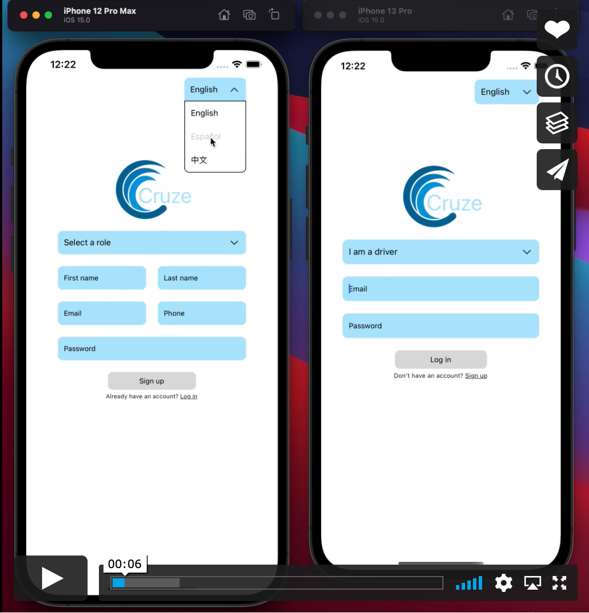

# Cruze

## Table of Contents
- [Team Members](#team-members-&-roles)
- [Description](#description)
- [Demonstration](#demonstration)
- [How to View](#how-to-view)
- [Technologies Used](#technologies-used)

## Team Members
- [David Du](https://github.com/EndlessDavidDu) - UI Team | [LinkedIn](https://www.linkedin.com/in/david-duy/)
- [Luna Zheng](https://github.com/luna-moon-1216) - Project Manager | [LinkedIn](https://www.linkedin.com/in/luna-zheng/)
- [Isaac Favila](https://github.com/IsaacFavila) - Architecture Team | [LinkedIn](https://www.linkedin.com/in/isaacmfavila/)
- [Jordan Villacorta](https://github.com/jordanvillacorta) - UI Team | [LinkedIn](https://www.linkedin.com/in/jordan-villacorta/)
- [Jin Cheng](https://github.com/jincheng411) - Architecture Team | [LinkedIn](https://www.linkedin.com/in/jincheng411/)
- [Sebastian Carazo](https://github.com/SebasCC99) - Project Manager | [LinkedIn](https://www.linkedin.com/in/sebastian-carazo/)

## Description
Cruze is a mobile ride-hailing app that provides language and dark mode support. Riders and drivers are able to communicate with each other to progress the status of the trip.

## Demonstration
  
Video link: https://player.vimeo.com/video/638202196

## How to run on local machine
To view on a local machine, please follow these instructions:
1. Fork the repository and clone to your local machine using: `git clone https://github.com/Team-Lovegood/Cruze.git`
2. Run `npm install` to download dependencies.
3. Add system IP address into /ip.js.
4. Enter postgreSQL user in /server/models/landingPage.
5. Run `\i schema.sql` after opening Postgres in /database.
6. Make Google API key with places, directions, and distance matrix enabled.
7. Create /config.js and /client/components/RiderHome/config.js and insert Google API key
8. Run `expo start` and `npm run server` in separate terminals.
9. Scan Expo QR code.

## Tech Stack

### Front-End
JavaScript 
 

React Native
 

React Navigation
 

CSS 
 

### Back-End
Socket.io 
 

Express.js 
 

PostgreSQL 
 

### Services
Firebase 
 

AWS EC2 
 

Google Cloud API 
 

### Development
Expo Go 
 

Xcode 
 

Babel 
 

Postman 
 

### Project Management
Notion 
 

Figma 
 

Slack 
 

Trello 
 
 

